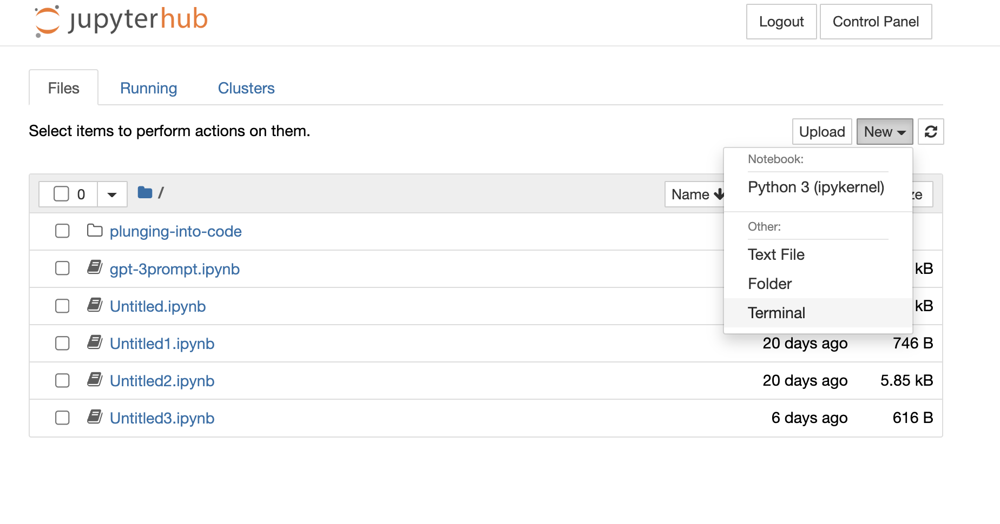

# Seminar Begin Cheat Sheet:

This is the page for hints beginning of the seminar:


### URL to the environment:

http://167.235.56.3/
https://dev.ground-zero.khm.de/jupyter-hub

login with your own account and password


## Download New Files from Github:

open Terminal page from `new`


</br>

use `cd` to move to the directory of our files, a blue line will be seen.
```bash
cd plunging-into-code
```


### Github Reset
use `git reset` to reset the repository branch, **remember to store your file in other name then the origin files**

```bash
git reset --hard origin/master
```


</br>

### Github Pull

use `git pull` to download all the new files from the week

```bash
git pull --force
```


## (optional) Changing from `jupyter notebook` interface to `jupyter lab` 

change the url from: `167.235.56.3/user/<yourname>/`

into `167.235.56.3/user/<yourname>/lab`


## starting with the seminar:

Go to the week we are working with.
open a new Python3 (ipykernel)

# **Happy Coding** 