# FLOSS + ART

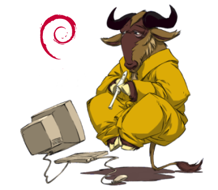


***Free Libre Open Source Software*** (FLOSS) wird stets  wichtiger für KulturarbeiterInnen, nicht nur wegen der Popularität  freier Lizenzen und Webtechnologien.  Künstlerisch-experimentell zu arbeiten jedoch -auf der Kommandozeile,  sowie auch Programmierung als Modis digitaler Produktion und  Distribution zu wählen- erfordert eine andere, kurz gesagt, eine kritischere Medienarbeit als es bei der Verwendung sogenannter Standardwerkzeuge von Adobe/Macromedia  und Apple der Fall ist. 
Die UNIX-Kommandozeile wurde eine in unserem Arbeitsalltag  allgegenwärtige Schnittstelle, die jedem Computer aus der  UNIX-Betriebssystemfamilie gemeinsam ist - ob Webserver, Wireless  Router, autonome Robotics, Raspberry Pi, OS X oder GNU/Linux-Laptops.


Das Arbeiten auf dieser Ebene bedeutet also nicht einfach,  Standardtools durch Gimp oder Kdenlive zu ersetzen. Gerade kleine, von  KünstlerInnen selbst geschriebene, die esoterischen Tools, sie geben uns wichtige Bausteine für die Kreation eigener Medien geben, anstatt der  vorgefertigten Medienkonzepte industrieller  Softwaregestaltungswerkzeuge. 

|                         | [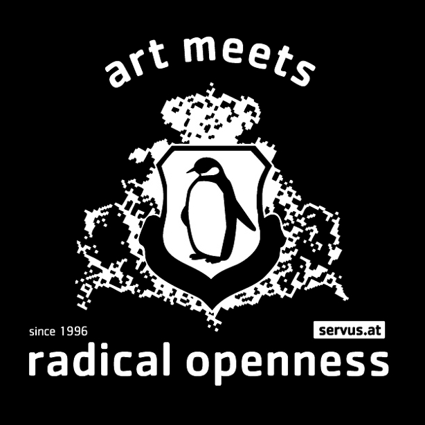](http://www.drosteeffectmag.com/wp-content/uploads/2014/06/radical_art_servus_52mm.jpg) |
| ------------------------------------------------------------ | ------------------------------------------------------------ |
| Piksel is an annual festival for artists and developers working with  free/open source software, hardware, and art in Bergen, Norway: https://22.piksel.no/ | AMRO, Art Meets Radical Openness, is a biennial festival for art, hacktivism and open cultures, organized since 2008 by **servus.at** in cooperation with the Linz University of Art, Department of Time-Based Media: https://radical-openness.org/ |


## UNIX-System

Unix ist ein Mehrbenutzer-Betriebssystem für Computer. Es wurde im August 1969 von Bell Laboratories zur Unterstützung der Softwareentwicklung entwickelt. Heute steht Unix allgemein für Betriebssysteme, die entweder ihren Ursprung im Unix-System von AT&T (ursprünglich Bell Laboratories) haben oder dessen Konzepte implementieren.

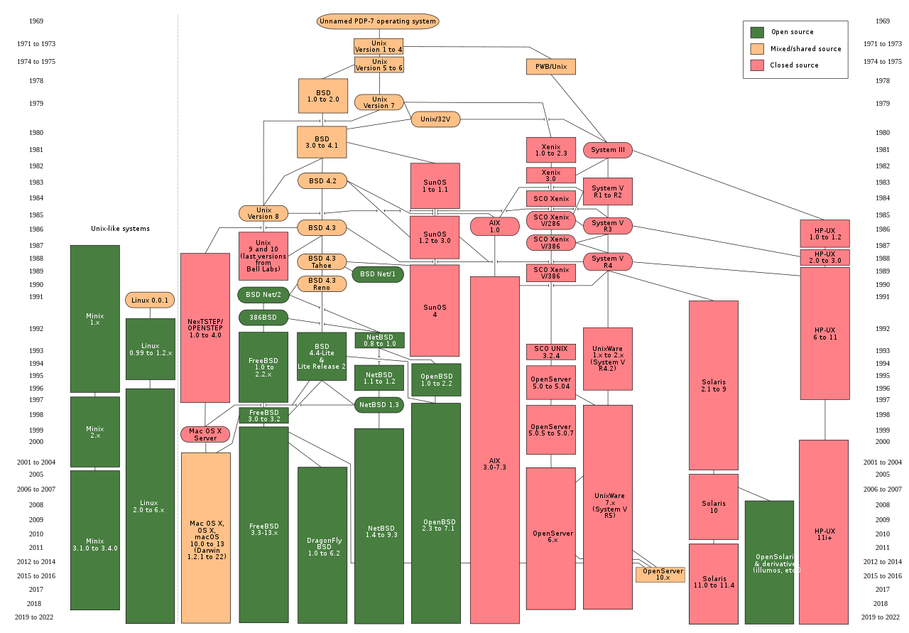

1969 		UNICS 						erste Version von Bell Laboratories

1977 		Erste Berkeley Software Distribution (BSD) 	

1979 		UNIX V7 (7th Edition) 				letzte Version von Bell Labs mit freiem Quellcode

1981 		UNIX System III 				erste kommerzielle Version von Bell Labs

1983 		Start des GNU-Projekts 				(GNU: Gnu is Not Unix – GNU ist nicht Unix)

1987 		Minix 1.0 					Unix-Klon der Freien Universität Amsterdam

1991 		Linux 						An Minix orientiert, große Verbreitung

2000 		Darwin 						Firma Apple, basierend auf Mach und 4.4BSD (Mac OS X)

### Linux-Distributionen (-Derivate)

Timeline: https://upload.wikimedia.org/wikipedia/commons/1/1b/Linux_Distribution_Timeline.svg

distros4artists: https://exmediawiki.khm.de/index.php/Distributionen

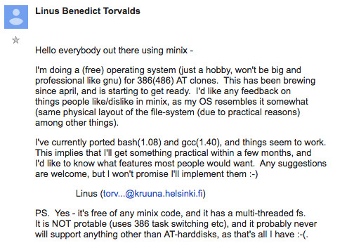

# FLOSS (Free Libre Open Source Software)

Eric Raymond < http://www.catb.org/~esr/writings/cathedral-bazaar/

Die Kathedrale und der Basar ist ein Essay über quelloffene Software von Eric S. Raymond, der ihn erstmals auf dem vierten Internationalen Linux-Kongress am 22. Mai 1997 in Würzburg öffentlich vortrug. Er beschreibt darin die Vor- und Nachteile der im Open-Source-Bereich inzwischen weit verbreiteten Entwicklungsmethode des Basars gegenüber der zuvor gebräuchlichen Methode, die er Kathedrale nennt. 

**Cathedral Model** < wenige Programmierer, in hierarchisch-strukturierten G ruppen mit engen Managmentvorgaben und langen Abstaenden zwischen den Veroeffentlichungen....

v.s.

**Bazaar Model** < weit voneinander entfernt wohnende Personen die miteinander kooperieren ... dadurch schnelle Veroeffentlichungen und jeder kann zum Endprodukt teilhaben

Im Essay sind 19 Richtlinien enthalten, wie gute Open-Source-Software programmiert werden kann (see: [Wikipedia](https://de.wikipedia.org/wiki/Die_Kathedrale_und_der_Basar)):

1. Jede gute Software wird von einem Entwickler geschrieben, der ein persönliches Problem lösen will.
2. Gute Programmierer wissen, was sie schreiben müssen. Brillante  wissen, was sie neuschreiben müssen (und was sie wiederverwenden  können).
3. Plane, eine Version zu verwerfen; du wirst es sowieso tun.
4. Wenn du die richtige Einstellung hast, werden dich interessante Probleme finden.
5. Wenn du das Interesse an einem Programm verlierst, ist es deine Pflicht, dieses einem kompetenten Nachfolger zu übergeben.
6. Wenn du deine Benutzer als Mitprogrammierer betrachtest, ist dies der einfachste Weg zu schneller Verbesserung und effizientem [Debugging](https://de.wikipedia.org/wiki/Debugging).
7. [Veröffentliche früh. Veröffentliche häufig.](https://de.wikipedia.org/wiki/Release_early,_release_often) Und höre auf die Benutzer.
8. Mit einer hinreichend großen Gruppe von Betatestern und  Mitentwicklern wird fast jedes Problem schnell erkannt und die Lösung  von jemandem gefunden.
9. Schlaue Datenstrukturen und einfacher Code (im englischen Original: „dumb code“) funktionieren viel besser als andersherum.
10. Wenn du deine Betatester wie deine wertvollste Ressource behandelst, werden sie dies auch werden.
11. Fast so gut wie eigene gute Ideen zu haben, ist es, gute Ideen von den Benutzern zu erkennen. Manchmal ist letzteres besser.
12. Meist entstehen die brillanten Lösungen aus der Erkenntnis, dass das Problem falsch verstanden wurde.
13. Perfektion (im Design) ist nicht erreicht, wenn man nichts mehr hinzufügen kann, sondern wenn nichts mehr entfernt werden kann.
14. Jedes Tool soll so funktionieren, wie erwartet. Aber ein wirklich  gutes Tool ermöglicht Verwendungszwecke, an die du niemals gedacht  hättest.
15. Wenn du [Schnittstellencode](https://de.wikipedia.org/wiki/Schnittstelle) schreibst, verhindere um jeden Preis, den Datenstrom zu verändern – und verwirf nur etwas, wenn dies der Empfänger verlangt.
16. Wenn deine Programmiersprache nicht ansatzweise [Turing-vollständig](https://de.wikipedia.org/wiki/Turing-Vollständigkeit) ist, kann [syntaktischer Zucker](https://de.wikipedia.org/wiki/Syntaktischer_Zucker) dein Freund sein.
17. Ein Sicherheitssystem ist nur so sicher wie sein Geheimnis. Vermeide Pseudogeheimnisse.
18. Um ein interessantes Problem zu lösen, suche eines.
19. Mit ausreichend guter Kommunikation, wie über das Internet, und Führung ohne Zwang, sind viele Köpfe immer besser als einer.

# GNU/Linux

|  | 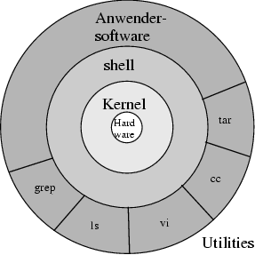 |
| -------------------------------------------------- | -------------------------------------- |


## Free Software

Watch: ./data/stallman.mp4

Interpret: ./floss.pd

### Freiheiten Freier Software 

 Software heißt frei, wenn sie dem Nutzer die folgenden vier Freiheiten lässt: 

1.  Verwenden  
    Die Freiheit, die Software uneingeschränkt und für jeden Zweck einzusetzen. 
2.  Verstehen  
    Die Freiheit, die Funktionsweise der Software untersuchen und verstehen zu können. 
3.  Verbreiten  
    Die Freiheit, Kopien der Software zu verbreiten, um damit seinen Mitmenschen zu helfen. 
4.  Verbessern  
    Die Freiheit, die Software zu verbessern und die Verbesserungen an die  Öffentlichkeit weiterzugeben, sodass die gesamte Gesellschaft davon  profitieren kann. 

# Kommandozeile

Die Command Line, bzw. Befehlszeile, oft auch als Konsole oder  Terminal bezeichnet, ist ein Eingabebereich zur Steuerung einer  Software. Je nach Betriebssystem wird auch von einer Shell gesprochen.  Die Kommandos oder Befehle werden als Zeichenketten über die Tastatur  eingegeben und sind oftmals Abkürzungen, die dem Englischen entnommen  sind.

Unix-Systeme müssen nicht unbedingt über eine grafische Benutzerschnittstelle (**G**raphical **U**ser **I**nterface, GUI) bedient werden. Auch unter einer GUI kann man mittels einer  Terminalemulation (z.B. xterm, terminator etc.) an einer Textkonsole  arbeiten. Oft sind Programme für das Terminal schnell und nicht  funktionsüberladen. Ein weiterer Vorteil ist die Möglichkeit, die Ein-  und Ausgabe über ein Netzwerk zu leiten (ssh, telnet). Dies funktioniert sogar, wenn die Übertragungsrate der Leitung sehr gering ist. Die für die Konsole verfügbare Software deckt viele Anwendungsbereiche  ab, oft verfolgen sie ein anderes Konzept als GUI-Software und sind  darum nicht direkt vergleichbar...: 

## Command Line Tools

Command Line Tools sind Programme die (meist) komplett ohne Graphical User Interface operieren. Für viele Tools gibt es die Möglichkeit eine  Version mit GUI zu installieren, sowie es z.B. für ffmpeg die GUI-  Version WinFF oder für espeak auch espeak-gui gibt. Die GUI's stellen  jedoch meist nur einen eingeschränkten Zugriff dessen dar, was direkt in der Command Line möglich ist.

Die Installation von Command Line Tools läuft unter Linux über apt-get oder aptitude, und in OS X über MacPorts.

see tiny list here: see: https://exmediawiki.khm.de/index.php/Command_Line_Tools

## Das Dateisystem

```
jupyter-christian@jupyter-hub:/$ tree -dL 1
.
├── bin
├── boot
├── dev
├── etc
├── home
├── lib
├── lib64
├── lost+found
├── media
├── mnt
├── opt
├── proc
├── root
├── run
├── sbin
├── srv
├── sys
├── tmp
├── usr
└── var
```


## ein paar grundlegende befehle...:


|                                                              |                               | Dateiverwaltung                                              |
| ------------------------------------------------------------ | ----------------------------- | ------------------------------------------------------------ |
| [cd](https://exmediawiki.khm.de/index.php?title=Cd&action=edit&redlink=1) | *change directory*            | Wechselt in ein anderes Verzeichnis[cp](https://exmediawiki.khm.de/index.php?title=Cp&action=edit&redlink=1) |
| [cp](https://exmediawiki.khm.de/index.php?title=Cp&action=edit&redlink=1) | *c*o*p*y                      | Dateien kopieren                                             |
| [cat](https://exmediawiki.khm.de/index.php?title=Cat&action=edit&redlink=1) | con*cat*enate (zusammenfügen) | Gibt eine oder mehrere Dateien hintereinander auf der Konsole aus |
| [pwd](https://exmediawiki.khm.de/index.php?title=Pwd&action=edit&redlink=1) | *p*rint *w*orking *d*irectory | Gibt das aktuelle Arbeitsverzeichnis aus                     |
| [less](https://exmediawiki.khm.de/index.php?title=Less&action=edit&redlink=1) |                               | Dateien betrachten                                           |
| [ln](https://exmediawiki.khm.de/index.php?title=Ln&action=edit&redlink=1) | *l*i*n*k                      | Erstellt einen symbolischen oder harten Link                 |
| [ls](https://exmediawiki.khm.de/index.php?title=Ls&action=edit&redlink=1) | *l*i*s*t                      | Auflisten von Dateien und  Verzeichnissen sowie deren Eigenschaften |
| [merge](https://exmediawiki.khm.de/index.php?title=Merge&action=edit&redlink=1) |                               |                                                              |
| [mkdir](https://exmediawiki.khm.de/index.php?title=Mkdir&action=edit&redlink=1) | *m*a*k*e *dir*ectory          | Erstellt ein neues Verzeichnis                               |
| [rm](https://exmediawiki.khm.de/index.php?title=Rm&action=edit&redlink=1) | *r*e*m*ove                    | Dateien und Verzeichnisse löschen                            |
| [rmdir](https://exmediawiki.khm.de/index.php?title=Rmdir&action=edit&redlink=1) | *r*e*m*ove *dir*ectory        | Ein leeres Verzeichnis löschen                               |
| [wc](https://exmediawiki.khm.de/index.php?title=Wc&action=edit&redlink=1) | *w*ord *c*ount                | Zählt Zeichen und Zeilen in einer Datei                      |

|                                                              | Suchen                                                       |
| ------------------------------------------------------------ | ------------------------------------------------------------ |
| [apropos](https://exmediawiki.khm.de/index.php?title=Apropos&action=edit&redlink=1) | Sucht nach einem Begriff in den Manualdatenbank (**man**).   |
| [locate](https://exmediawiki.khm.de/index.php?title=Locate&action=edit&redlink=1) | Sucht Dateien mittels eines Indexes, der durch updatedb erstellt wird. |
| [slocate](https://exmediawiki.khm.de/index.php?title=Locate&action=edit&redlink=1) | Alternative zu locate. Durchsucht die Dateien auf die ein Benutzer Zugriff hat. |
| [find](https://exmediawiki.khm.de/index.php?title=Find&action=edit&redlink=1) | Sucht nach Dateien in einem Verzeichnis.                     |
| [grep](https://exmediawiki.khm.de/index.php?title=Grep&action=edit&redlink=1) | Durchsucht eine Datei nach einem bestimmten Ausdruck oder Muster (*Regular Expression*). Varianten davon sind egrep und fgrep. |


|                                                              | some more useful stuff...:                                   |
| ------------------------------------------------------------ | ------------------------------------------------------------ |
| [ping](https://exmediawiki.khm.de/index.php?title=Ping&action=edit&redlink=1) | Sendet Ping-Pakete an einen Zielrechner und meldet Rückantwort. |
| [reboot](https://exmediawiki.khm.de/index.php?title=Reboot&action=edit&redlink=1) | Startet den Computer neu                                     |
| [su](https://exmediawiki.khm.de/index.php?title=Su&action=edit&redlink=1) | Wechsel des Benutzers und Umschalten auf den Rootnutzer      |
| [echo](https://exmediawiki.khm.de/index.php?title=Echo&action=edit&redlink=1) | Gibt einen Text auf der Konsole aus                          |
| [sleep](https://exmediawiki.khm.de/index.php?title=Sleep&action=edit&redlink=1) | Eine Anzahl von Sekunden warten                              |
| [chmod](https://exmediawiki.khm.de/index.php?title=Benutzerverwaltung&action=edit&redlink=1) | Zugriffrechte von Dateien und Verzeichnissen ändern          |

---

---

### Intermezzo Wildcards

see: https://exmediawiki.khm.de/index.php/Wildcards

Will man mehrere Dateien als Argumente für einen UNIX-Befehl verwenden,  kann  man sie meist einfach aufzählen. Die meisten Kommandozeilenprogramme  sind  unter UNIX so geschrieben, dass sie beliebig viele Dateien als Argumente akzeptieren. Um die Aufzählung zu vereinfachen, kann man mit Hilfe  einer Maske mehrere Dateien zusammenfassen. Die Shell sucht die auf die  Maske passenden Dateien zusammen und übergibt sie als Liste dem  aufgerufenen Programm. 

### Ein erstes kleines Programm

```
#!/bin/bash
x=Hello 
y=World
z=!
echo x yz 
```

save it as hw.sh

navigate to folder

type:

```
chmod +x hw.sj
```

to make the file executable

start the program with:

```
./hw.sh
```

#### ein anderes Beispiel, der for loop

```
#!/bin/bash
for i in blau gelb grün schwarz
do
echo "Meine Lieblingsfarbe ist $i"
done
```


---

## diving into computerimages...


<pre>
"...dass jedes Kunstwerk, auch wenn es nach einer ausdrücklichen oder 
unausdrücklichen Poetik der Notwendigkeit produziert wurde, wesensmässig offen ist 
für eine virtuell unendliche Reihe möglicher Lesearten, 
deren jede das Werk gemäss deiner persönlichen Perspektive, 
Geschmacksrichtung, Ausführung neu belebt;"
</pre>


Umberto Eco
das offene Kunstwerk« (1962)

*...dass es nicht darum geht „was“ das Bild ist, sondern „wie“ wir es lesen*

---

Bildinterpreter bzw. ImageViewer sind darauf ausgelegt 
uns nur ausgewählte einzelheiten eines Datensatzes, 
welcher sich dann bild oder song, oder videoclip oder whatever which adaption zu unserer realwelt nennt, 

zu interpretieren. 

das was wir meist in erster linie bei einem bild nicht zu gesicht bekommen ist z.B. das:

1. Metadata

```
exiftool ./data/luther.jpg
```


...die art wie wir die bilder lesen hat jedoch einen großen Einfluß darauf, 

wie wir mit bildern arbeiten,

oder eben in welche ästhetischen Räume wir uns begeben:

## glitch-art

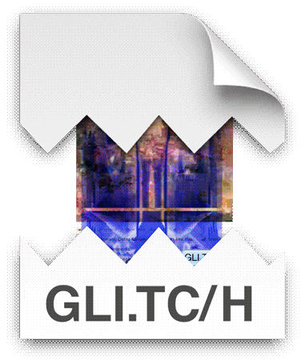

    creation through destruction

Glitch art is the aestheticization of digital or analog errors, such as artifacts and other "bugs", by either corrupting digital code/data or by physically manipulating electronic devices

watch: nick.webm #timestamp: 08:03 

### Andy King

| 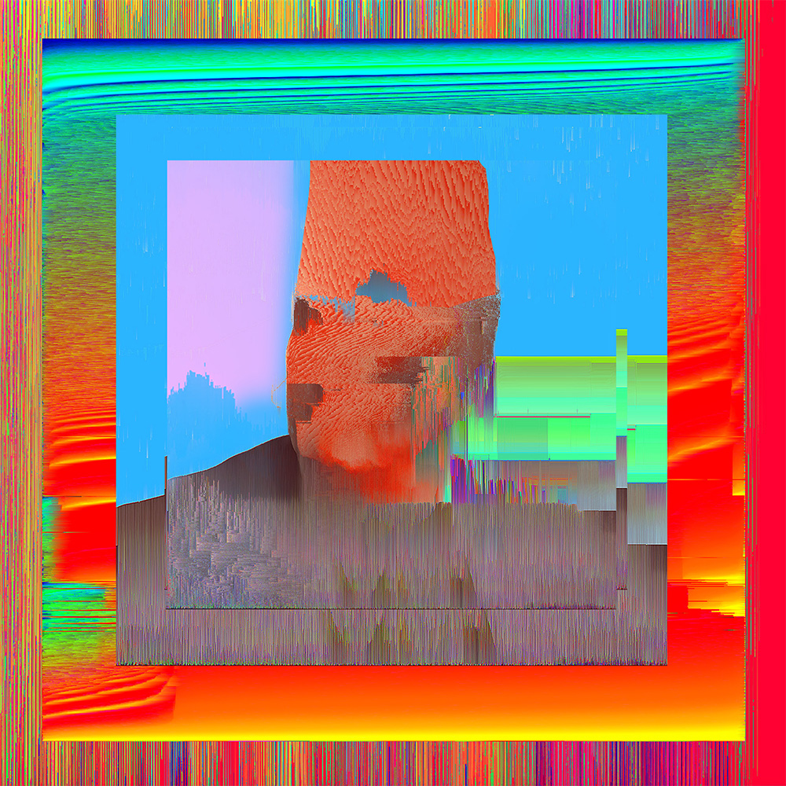 |  | 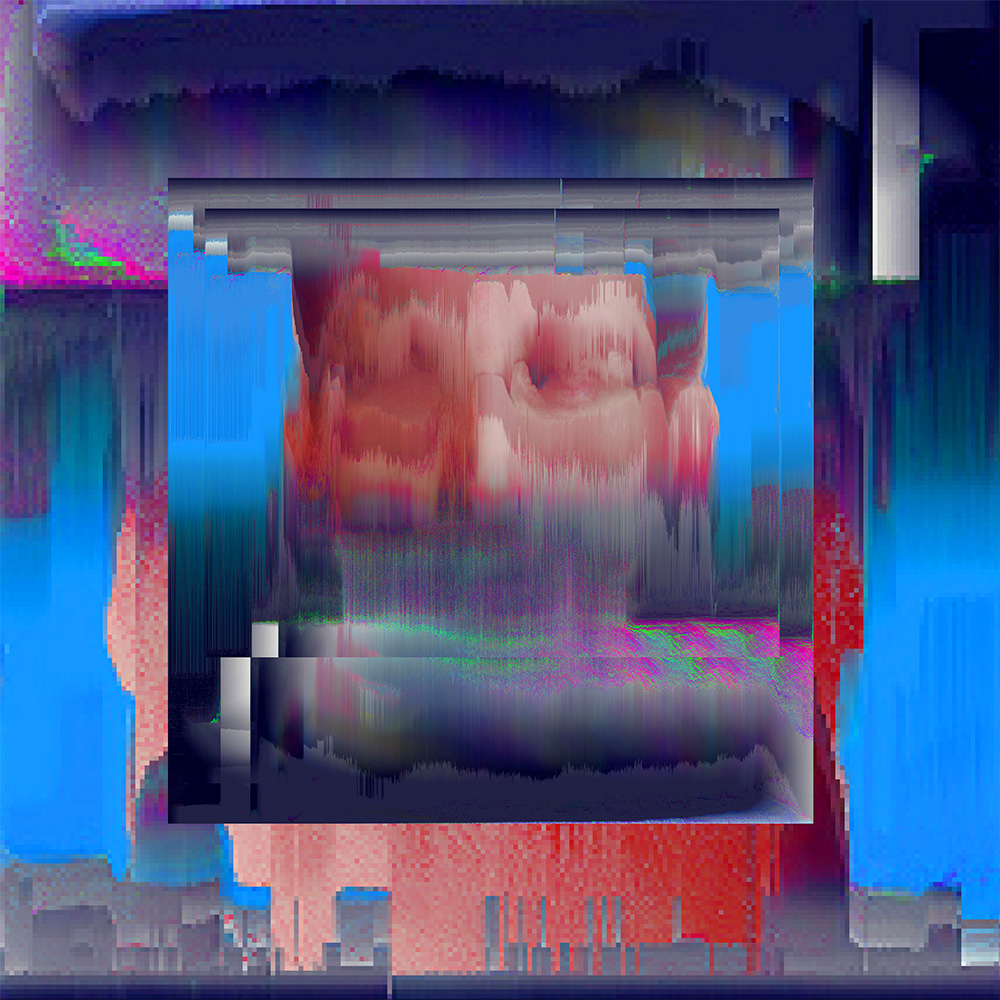 |
| ------------------------------------------------------ | ------------------------------------------------ | -------------------------------------------------------- |

<pre>So I took the portraits of Bill Binney, Snowden and Chelsea Manning and
I inserted the American Constitution as well as excerpts from Obama's
speech about the NSA into the image code, and them combined it with
glitching software online, as well as glitching code in Processing 
</pre>

---


| 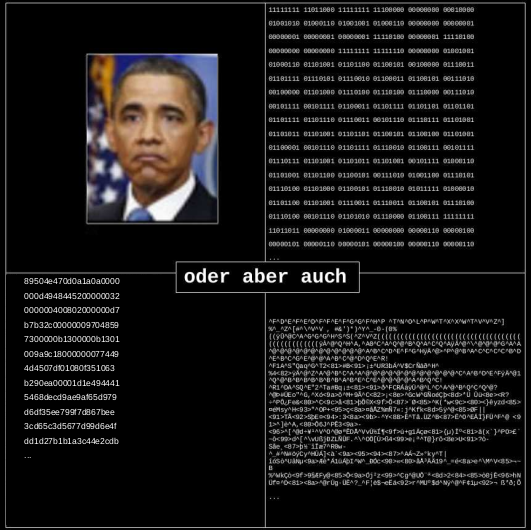 | 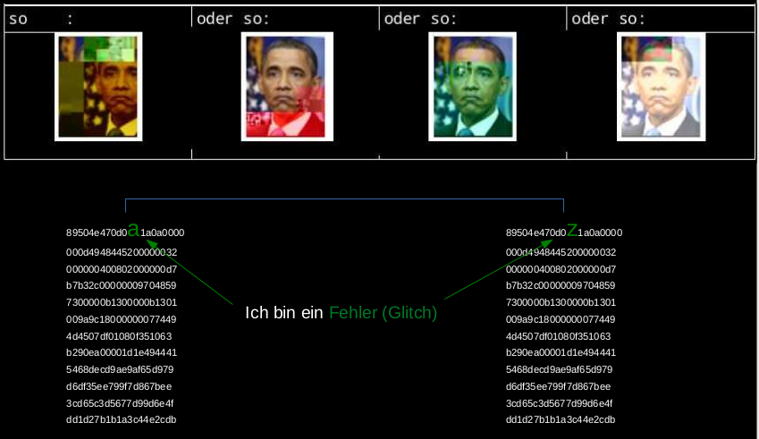 |
| ------------------------ | ------------------------ |

watch jpg, interpreted as hex & binary:

```
xxd luther.jpg #hex

xxd -b luther.jpg #-b for binary
```


...interpreted as ascii:

```
cat luther.jpg

cat luther.jpg | tr -c '[:print:]' ' '
```


...interpreted as sound:

```
enscribe luther.jpg luther.aiff && mplayer luther.aiff
```

convert jpg to bitmap format:

```
convert luther.jpg luther.bmp
```

watch hexdump:

```
xxd luther.jpg|less 
```


## Intermezzo Pipe

```
#Douglas McIlroy, der Erfinder der Unix-Pipes, fasste die Philosophie folgendermaßen zusammen:
echo "the philosophy of UNIX"|pv -qL 20
sleep 3
echo "  * Schreibe Computerprogramme so, dass sie nur eine Aufgabe erledigen und diese gut machen."|pv -qL 20
sleep 1 
echo "  * Schreibe Programme so, dass sie zusammenarbeiten."|pv -qL 20
sleep 1 
echo "  * Schreibe Programme so, dass sie Textströme verarbeiten, denn das ist eine universelle Schnittstelle."|pv -qL 20
```

---


## code poetry

TASK: start walkmonster.sh in terminal

#### jodi's »walkmonster_start()«

<pre>$cd ug/models/soldier3
$origin 0 -6 24
$base base
$skin skin
$frame soldierc
$frame soldierd
/*
*/
void() army_fire;
void() army_stand1 =[ $soldierc, army_stand2 ]
{ai_stand();};
(...)</pre>


>> hier der code im terminal (pv -qL...)


...the poem is a functional source code in the programming language C. Indeed, the text is one part of a source code of Jodi's untitled game. This code is based on the source code of the commercial computer game Quake. By holding back the information about its origin and function, Jodi's e-mail...

veröffentlicht in der nettime mailinglist im jahr 2001


#### Jaromil's Forkbomb

```bash
:(){ :|:& };:
```

- :() defines the function named as `:` and will accept no arguments.
- `{}` is where the function starts and ends. In simple terms, it includes commands that will crash your machine eventually. 
- `:|:` is where the recursion starts (function calling itself). To be more precise, It loads a `:` function in memory, pipe (`|`) its own output to another copy of the `:` function which is also loaded into system memory as well.
- `&` will execute the whole function in the background so that no child process is killed.
- `;` separates each child function from the chain of multiple executions. 
- And `:` runs recently created function, hence the chain reaction begins!

---

---


## Networking

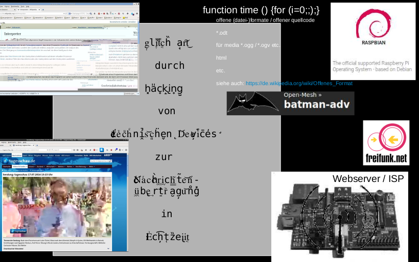

### Freifunk 

Homepage: https://freifunk.net/

Map Köln: https://map.kbu.freifunk.net/

| 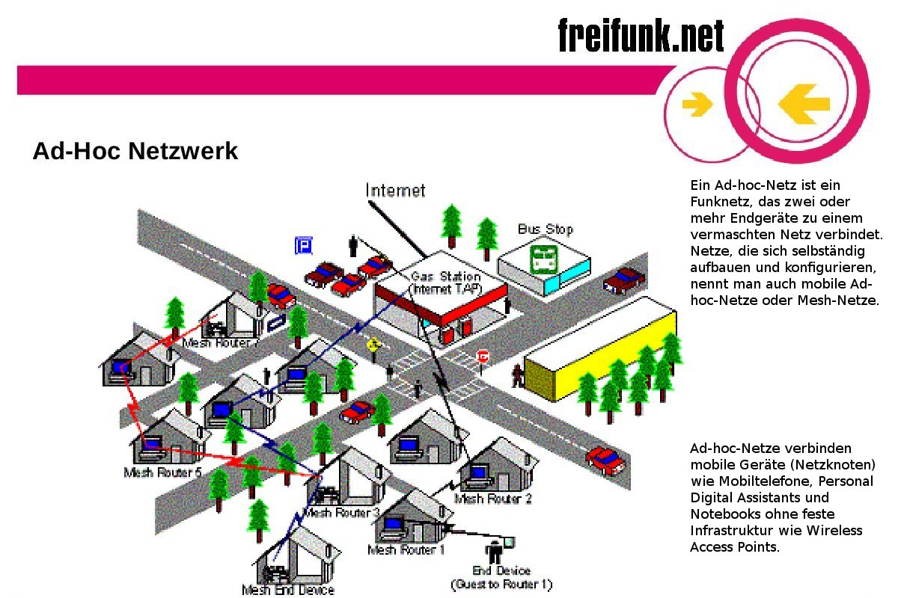 | 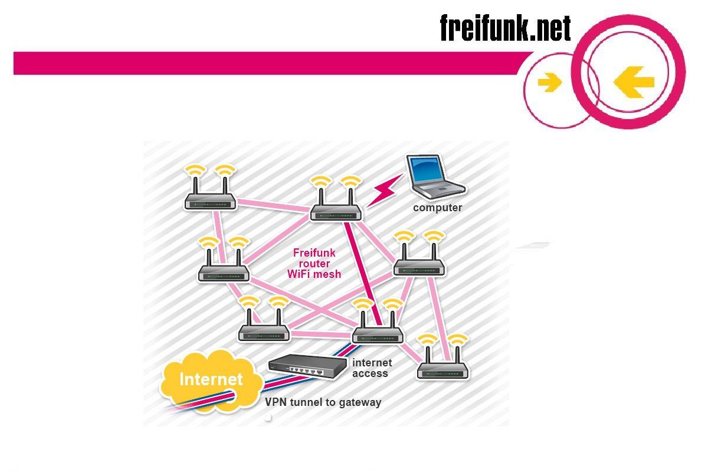 | 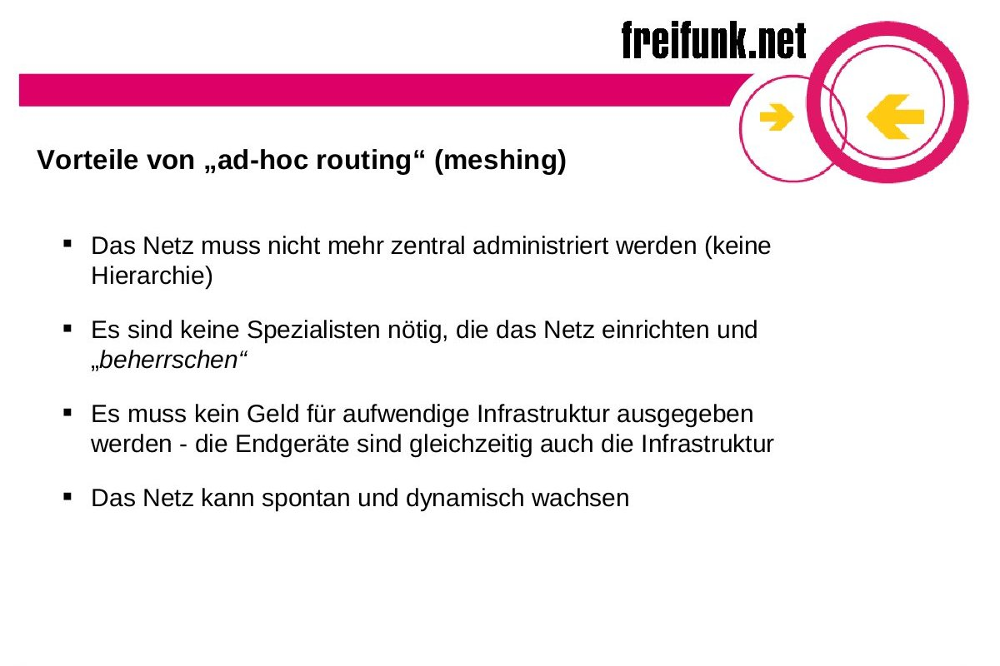 |
| -------------------- | -------------------- | -------------------- |

---

## Connect to Raspberry Pi

### over VNC

download vnc-viewer: https://www.realvnc.com/en/connect/download/viewer/

install it

loginto WIFI-mac network: Lab3s Imac

open vnc-viewer

connect to 192.168.2.44


### over SSH

| useful commands...                              |      |                                                              |
| ----------------------------------------------- | ---- | ------------------------------------------------------------ |
| ssh username@IP-adress                          |      | Login Raspberry Pi                                           |
| ssh -X username@IP-adress                       |      | graphical Login (X Forwarding)                               |
| scp ~/Bsp.jpg uname@IP-adress:/home/uname       |      | Dateien zwischen eigenem und Raspberry Pi kopieren           |
| scp -r ~/directory uname@IP-adress:/home/uname/ |      | Folder mit Inhalt zwischen eigenem und Raspberry Pi kopieren |
| exit                                            |      | Logout aus Raspberry Pi                                      |

for login to Raspberry Pi type:

```
ssh pi@192.168.2.44
```

#### scp

**einfaches Kopieren**

```
$ scp ~/Bsp.jpg username@IPadress:/home/username
$ scp username@IPadress:/home/username/Bsp.jpg ~/
```


 **Rekursives Kopieren (Ordner+Inhalt)**

```
$ scp -r ~/BspOrdner username@IPadress:/home/username
$ scp -r username@IPadress:/home/username/BspOrdner ~/
```


### over SSHFS

#### von Mac zu Linux

**1. »FUSE for macOS« + »SSHFS« download & install:**

- https://osxfuse.github.io/

**2. terminal öffnen**

**3. folder in den gemounted werden soll erstellen:**

```
mkdir ssh-rasp-pi
```

**4. in diesen folder navigieren:**

```
cd ssh-rasp-pi/
```

**5. mounten (entsprechende IP-Adresse eintragen für internen/externen Zugang):**

```
sshfs pi@192.168.2.44:/home/ .
```

**6. der Folder "/home/" des Raspberry Pi's ist nun im Folder "ssh-rasp-pi" auf dem eigenen Rechner gemountet**

#### von Linux zu Linux

**1. folder in den gemounted werden soll erstellen:**

```
mkdir ssh-rasp-pi
```

**2. in diesen folder navigieren:**

```
cd ssh-rasp-pi/
```

**3. mounten:**

```
sshfs pi@192.168.2.44:/home/ .
```